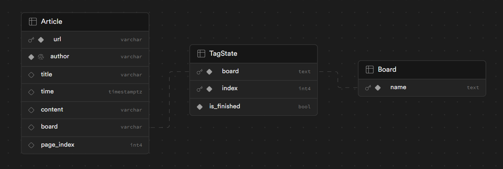

# PTT 爬蟲 + 資料標註工具

## Installation
`
pip install -r requirements.txt
`

## Usage 1 : Crawler
在 `main.py` 內有範例。

### 1. 引入 Article 類別

在你的程式碼中引入 `src/article.py` 內的 `Article` 類別：

```python
from src.article import Article
```

### 2. 創建 Article 物件

使用 `Article` 類別創建一個文章物件。在建構時，傳入 PTT 文章的網址（不包括 "https://www.ptt.cc" 部分）：

```python
article = Article("/bbs/car/M.1709972123.A.A17.html")
```

### 3. 查看文章資訊

透過`Article`物件可以查看文章資訊，內部包含`Comment`物件的`list`則是文章下方留言

```python
print("URL : " , article.url)        # 文章的 URL (str)
print("Author : " , article.author)  # 文章的作者 (str)
print("Title : " , article.title)    # 文章的標題 (str)
print("Board : " , article.board)    # 文章所屬的看板 (str)
print("Time : " , article.date_time) # 文章發布的日期和時間 (datetime.datetime 物件)
print(article.content)               # 文章的本文 (str)
for comment in article.comment:      # 文章的所有留言 (list[Comment])
    print("--------------------comment-----------------------")
    print(f"tag : {comment.tag}")           # 評論的標籤 (str)
    print(f"author : {comment.author}")     # 評論的作者 (str)
    print(f"content : {comment.content}")   # 評論的內容 (str)
    print(f"ip : {comment.ip}")             # 評論發布時的 IP 地址 (str or None)
    print(f"datetime : {comment.date_time}")# 評論發布的日期和時間 (datetime.datetime 物件)
```

## Usage 2 : Data Labeler
在 `simple_view.py` 內有範例。

### 1. 設定SUPABASE

申請 Supabase 並依照以下 schema 建立資料庫。


在根目錄加入`.env`檔案，並寫入Supabase相關資訊。
```env
SUPABASE_URL = '{Your Supabase URL}'
SUPABASE_KEY = '{Your Supabase Key}'
```

### 2. 建立標註的標籤類別

按照下列格式寫入標籤。
`id` 為標注後表示資料類別的向量的index，有n個類別則id必須由0 ~ n-1
`name` 為類別名字，開始標註時會顯示在畫面上
`description` 為類別描述，僅為輔助用
```json
{
    "categories": [
        {
            "id": 0,
            "name": "tag1_name",
            "description": "tag1_description"
        },
        {
            "id": 1,
            "name": "tag2_name",
            "description": "tag2_description"
        }
    ]
}
```

### 3. 引入Model物件

`Model`物件是MVC架構的Model部分，為系統的主要邏輯，包含本地 Json 讀/寫 管理，以及資料庫的存取等。

```python
from src.model import Model
```

### 4. 開始標註

建立`Model`物件時開始初始化，第一次執行時會自動建立 `src/temp_article.json` 與 `src/temp_article_list.json` 和 `result/result.json`，分別為本篇文章還沒標註的留言、本頁未標註的文章以及標注完成的留言+標籤。  

初始化過程中會檢查 `src/temp_article.json`內還有沒有留言，沒有則會再根據 `src/temp_article_list.json` 去爬新的文章，如果本頁沒有文章後則會和資料庫回報頁數已完成，並和資料庫要下一頁的index，在根據index去ptt爬新的資料下來。  

```python
model = Model()
```

初始化後即可開始標註。  

`Model` method說明

```python
class Model:

    def NextComment(self) -> None:
        # 標註完成後換下一則留言

    def ClearTag(self) -> None:
        # 清除以標註的內容

    def Save(self):
        # 將已標註的部分存入result.json (換新文章以及結束時會自動儲存)

    def GetNowArticle(self) -> Article:
        # 取得現在的文章物件

    def GetNowComment(self) -> dict:
        # 取得現在的留言
    
    def AddCommentTag(self, label_index : int) -> None:
        # 對現在的留言加入標記

    def DeleteNowComment(self) -> None:
        # 刪除現在的留言

    def GetLabels(self) -> list[str]:
        # 取得現在的留言的標記內容
```

## 注意事項

- 目前此工具僅支援爬取單篇文章，若需要爬取其他類型文章或多篇文章，需進行程式碼調整。
- 在使用時，請小心遵守 PTT 網站的使用條款，以免觸碰到網站的爬蟲規定。